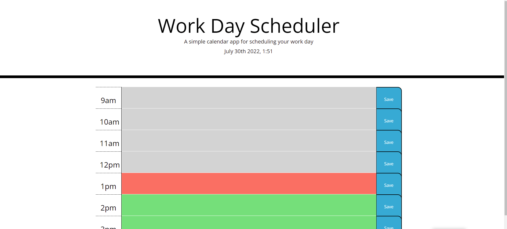

# Module 5 Refactor Challenge

## Deployed Link
https://zserrano.github.io/workday-scheduler/

## Screenshot of Deployed Website

## Description
Created a functioning workday scheduler by adding to the starter code given to me and following the acceptance criteria given.  User will is able to see time blocks representing 9am-5pm, enter text in each time block, and save that text to local storage utilizing the save button on the right end of each block.  Save button allows information in each text area to be saved even if the page is refreshed.  

## Process
- Created one time block row on html page 
- Filled row with a div to show time on the left-hand side, a textarea section in the center, and a 'Save' button on the right-hand side
- Added classes throughout the row that were given in the CSS file
- Copied and pasted row eight times to create remaining needed time blocks; edited each to represent the correct time
- In the Javascript file, I wrote methods to store keys and values in local storage from each row
- Created a function to go through each time block and utilize Moment.js to add/remove classes to each block based on what time it was when the user opened up the site; different colors represented past, present, and future blocks
- Created methods to pull data from local storage that was saved using the 'Save' button in order to ensure it remains on the page even if the page is refreshed

## Contributors
- Zach Serrano (myself)

## Technologies Used
- Bootstrap 
- JQuery
- Moment.js
